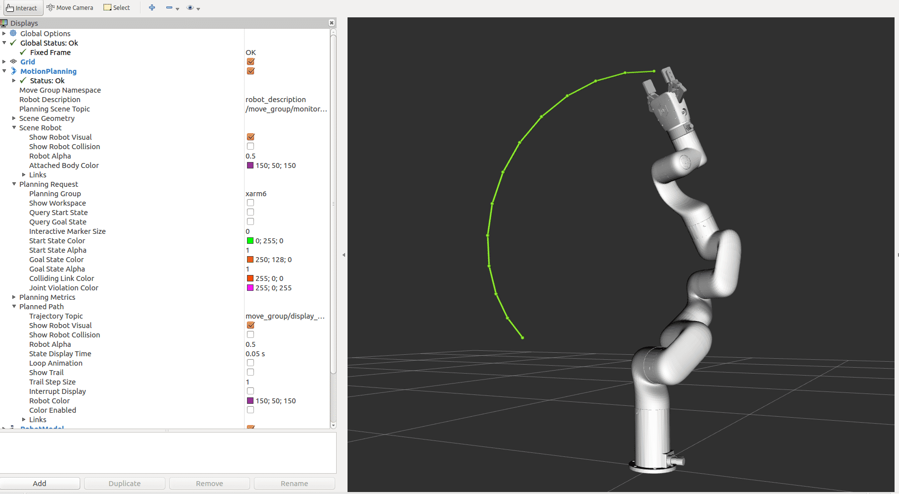
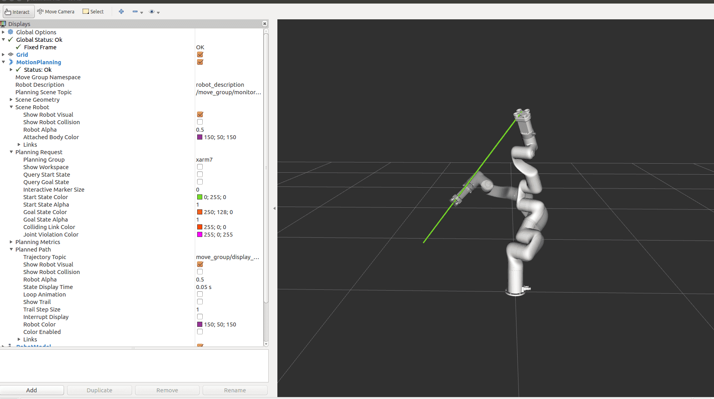

# Package 描述
&ensp;&ensp;这个package是用于提供给用户一个编程接口去使用moveit!, 而不仅仅限于图形界面。为了达到更好的使用效果，用户需要提前学习[Moveit的官方教程](http://docs.ros.org/kinetic/api/moveit_tutorials/html/)。
&ensp;&ensp;'xarm_simple_planner' 其实只是基于Move_group interface的简单包装， 如果用户对于高级的配置 (constraints, 切换不同的kinematic solver或者planners, etc)有需求, 可以自己充分利用Moveit的功能实现更复杂的结构。

# xArm simple planner使用指南
## 启动simple planner:
如果希望在仿真环境中使用，运行:
```bash
   $ roslaunch xarm_planner xarm_planner_rviz_sim.launch robot_dof:=<7|6|5> add_gripper:=<true|false> add_vacuum_gripper:=<true|false>
```
或者如果希望直接控制真机，运行:  
```bash
   $ roslaunch xarm_planner xarm_planner_realHW.launch robot_ip:=<your controller box LAN IP address> robot_dof:=<7|6|5> add_gripper:=<true|false> add_vacuum_gripper:=<true|false>
```   
'robot_dof'参数指的是xArm的关节数目 (默认值为7)，'add_gripper'和'add_vacuum_gripper'参数是为了手臂末端安装了UF末端执行器的情况准备的，只能加载一种末端执行器。  

这个节点提供针对笛卡尔或者关节坐标进行轨迹规划的service，Service的定义可以在srv文件夹寻找。 用户可以调用相关service去尝试进行轨迹规划求解, 并会收到成功与否的布尔值。 按以上步骤启动节点之后，可以先尝试命令行方法使用：

## 关节空间点到点目标规划:  
```bash
   $ rosservice call xarm_joint_plan 'target: [1.0, -0.5, 0.0, -0.3, 0.0, 0.0, 0.5]'
```
这种情况下列表中的元素代表每个关节的目标角度(单位是radian), 给定元素个数为关节数目。  

## 笛卡尔空间点到点目标规划:  
```bash
   $ rosservice call xarm_pose_plan 'target: [[0.28, 0.2, 0.2], [1.0, 0.0, 0.0, 0.0]]'
```
目标列表中的域分别指代工具坐标系原点位置(x, y, z)，单位：***米***；以及 ***四元数*** 方位(x, y, z, w)。注意此规划命令依然是简单的点到点运动，末端的执行轨迹并不是一条直线。  

## 笛卡尔空间直线轨迹规划:
```bash
   $ rosservice call xarm_straight_plan 'target: [[0.28, 0.2, 0.2], [1.0, 0.0, 0.0, 0.0]]'
```
指令数据的单位和之前的笛卡尔指令一致。如果规划成功，末端执行轨迹会是一条直线。但是在这种规划中，笛卡尔速度的变化可能不是很常规，请参考官方的Move Group Interface文档并在需要的时候修改代码。  


调用以上服务之后, 会返回名为'success'的布尔结果。 

### 四元数计算提示：
以上笛卡尔规划目标的姿态使用四元数表示，如果您对于从(roll, pitch, yaw)计算四元数的方法不熟悉，请参考[此链接](http://wiki.ros.org/tf2/Tutorials/Quaternions#Think_in_RPY_then_convert_to_quaternion)。  

## 执行规划好的轨迹:  

***请注意: 使用笛卡尔规划时, Moveit (OMPL) 每次生成的路径可能非常不同且比较随机，并不一定是移动距离最小的解, 所以在执行前一定在仿真环境中确认轨迹!*** 

如果存在满意的解, 用户可以通过service(**推荐**)或topic下达执行命令。 

### 通过service call执行 (阻塞式)
调用'xarm_exec_plan' service 并将request的data设为'true', 则上一次成功解算的轨迹会被执行, service call会在执行完毕后返回，命令行运行:  
```bash
   $ rosservice call xarm_exec_plan 'true'
```

### 通过topic执行 (非阻塞式)
只需要通过话题"/xarm_planner_exec"发布一条消息 (类型: std_msgs/Bool), 内容设为'true'即可命令机械臂执行轨迹, 但是这种方法会直接返回而不是等待执行完成:  
```bash
   $ rostopic pub -1 /xarm_planner_exec std_msgs/Bool 'true'
```

除了命令行，另一种调用service或发布topic的方法是通过编程的方法。 用户可以参考[ROS教程1](http://wiki.ros.org/ROS/Tutorials/WritingServiceClient%28c%2B%2B%29) 以及 [ROS教程2](http://wiki.ros.org/ROS/Tutorials/WritingPublisherSubscriber%28c%2B%2B%29) 去了解怎样实现, 亦或者参考 src 目录下的'xarm_simple_planner_test.cpp'。  
若想执行此测试程序( ***此测试程序仅限xArm7运行***，不过用户可以更改源代码里的指令以适用于6关节或5关节), 在启动simple planner节点后，运行:
```bash
   $ rosrun xarm_planner xarm_simple_planner_test
```
这个测试程序会运行一些设计好的轨迹, ***执行前请确保机械臂周围有足够的空间!***

### 规划轨迹的可视化
参考issue [#57](https://github.com/xArm-Developer/xarm_ros/issues/57), xArm和end-effector模型描述文档已经重新修改，使得规划成功的末端轨迹可以在Rviz中显示出来，如下图所示:   



